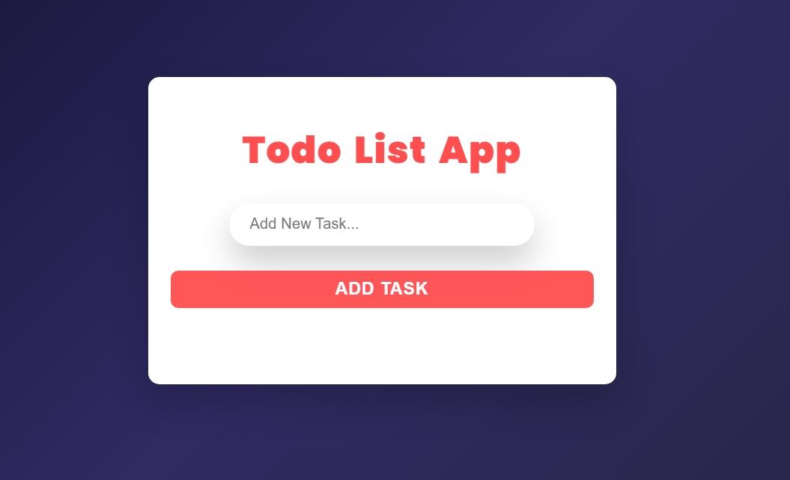

# Movie App – Web Masters Internship Project



## Project Overview
A clean, responsive Todo List web application built with **HTML**, **CSS**, and **JavaScript**. This app allows users to manage tasks with features such as adding, deleting, marking as done, and storing tasks in local storage.

**Live Demo:** [To Do List App Demo](https://todo-app-web-masters.vercel.app/)

## Features
- Add new tasks
- Mark tasks as completed/uncompleted
- Delete tasks
- Inline status icons (checked/unchecked)
- Toast-style message box with dynamic colors
- Data persistence using localStorage
- Responsive & modern UI

## Technologies Used
- **HTML5**
- **CSS3**
- **JavaScript**
- **LocalStorage**
- **Google Fonts**

## Project Structure
```
todo-app-web-masters/
├── index.html
├── style.css
├── main.js
├── images/
│   ├── checked.png
│   └── unchecked.png
├── media/
│   └── toDoApp.mp4
└── README.md
```

## Getting Started
1. **Clone the repository:**
```
git clone https://github.com/Abdelaziz-Mohammed/todo-app-web-masters.git
```
2. **Navigate to the project directory:**
```
cd todo-app-web-masters
```
3. **Open index.html in your preferred web browser:**
```
open index.html
```

## 👨‍💻 Author
**Eng. Abdelaziz Mohamed**

- [LinkedIn](https://www.linkedin.com/in/abdelaziz)
- [GitHub](https://github.com/Abdelaziz-Mohammed)